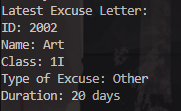

|            | Algorithm and Data Structure                 |
| ---------- | -------------------------------------------- |
| NIM        | 244107020214                                 |
| Nama       | Faiq Razzan Afifie                           |
| Kelas      | TI - 1I                                      |
| Repository | [link] (https://github.com/faiq191/JobSheet) |

# Labs #2 Class and Object

## 2.1 Experiment 1: Assignment Submission

**Brief explanaton:**

1. Purpose:

   - Demonstrates the use of a stack to manage student assignment submissions.

2. Classes Involved:

   - Student Class: Holds student information (name, NIM, class, and grade).
   - StudentAssignmentStack Class: Manages the stack operations for student submissions.

3. Key Stack Operations:

   - Push: Adds a student's assignment to the stack.
   - Pop: Removes a student from the stack and grades them.
   - Peek: Views the top assignment (student) in the stack.
   - Print: Displays all student assignments in the stack.

4. Main Functionality:
   - Submit an assignment, grade it, and view all assignments or the top one in the stack.

## 2.1.2 Verification Experiment Results


## 2.1.3 Questions

1. Explain the role of the stack data structure in the student assignment management system. Why was a stack used instead of another data structure (e.g., queue or list)?
   The stack data structure is used to manage student assignments based on the Last In, First Out (LIFO) principle. The most recent assignment submitted is graded first, aligning with the natural behavior of a stack. A stack is preferred here because it simplifies the process of retrieving the latest submission. Other data structures like queues (FIFO) or lists do not inherently support this behavior and would require additional logic.

2. What is the difference between the push() and pop() methods in a stack, and how are they used in this program?

- push(): Adds a new element (student assignment) to the top of the stack. In this program, push() is used when a student submits their assignment.
- pop(): Removes and returns the element at the top of the stack. In this program, pop() is used when the lecturer retrieves the most recent assignment for grading.

3. Why is it important to check the condition !isFull() before calling the push() method? What could go wrong if this check is removed?
   Checking !isFull() ensures that there is enough space in the stack before adding a new element. If this check is omitted and the stack is full, adding a new element would result in an ArrayIndexOutOfBoundsException or similar runtime error.

4. How many student assignments can be stored in the current implementation of the stack? Provide the specific line of code or variable that determines this.
   The stack can store up to 5 student assignments, as specified by the following line in StudentDemo:
   StudentAssignmentStack stack = new StudentAssignmentStack(5);
   This value initializes the size attribute of the stack.

5. Modify the existing stack implementation so that the system can also show the first student who submitted their assignment. Describe the changes you made in both StudentDemo and StudentAssignmentStack classes.

- In StudentAssignmentStack:
  Added a getFirst() method:
  public Student getFirst() {
  if (!isEmpty()) {
  return stack[0];
  } else {
  System.out.println("Stack is empty!");
  return null;
  }
  }
- In StudentDemo:
  Added a menu option to display the first student:
  case 6:
  Student firstStudent = stack.getFirst();
  if (firstStudent != null) {
  System.out.println("The first assignment comes from " + firstStudent.name);
  }
  break;

6. Implement a method to count and return the number of assignments currently stored in the stack. Describe how your method works.

- In StudentAssignmentStack:
  Added a countAssignments() method:
  public int countAssignments() {
  return top + 1; // top is zero-based, so add 1 to get the count
  }
- This method works by utilizing the top variable, which keeps track of the index of the last element in the stack. Adding 1 to this value gives the total number of elements in the stack.

- In StudentDemo:
  Added a menu option to display the count:
  case 7:
  System.out.println("Number of assignments: " + stack.countAssignments());
  break;

7. What did you learn from this experiment about stack-based systems? Reflect on a real-world application where this kind of system might be useful.
   I learned that stacks are efficient for scenarios requiring LIFO processing. Their simplicity makes them ideal for managing elements in reverse order. Real-world applications include:

- Undo functionality in text editors.
- Browser history management.
- Call stacks in programming languages.

8. Don’t forget to synchronize the changes you made from this question into your repository!

- Stage the changes:
  git add .
- Commit with a meaningful message:
  git commit -m "Completed stack-based enhancements"
- Push to the repository:
  git push origin main

## 2.2 Experiment 2:

**Brief explanaton:**

1. Purpose:

   - Converts a student's grade (integer) into binary using a stack.

2. Classes Involved:

   - ConversionStack Class: Handles the conversion of grades to binary using stack operations.

3. Key Stack Operations:

   - Push: Adds the binary digits (0 or 1) to the stack.
   - Pop: Removes and returns binary digits from the stack to form the complete binary number.

4. Main Functionality:
   - Converts a student's grade into binary by repeatedly dividing the grade by 2 and storing the remainders in the stack.
     Finally, the binary number is formed by popping the stack.

## 2.2.2 Verification


## 2.2.3 Questions

1. Explain the workflow of the convertToBinary() method.
   convertToBinary() method
   The convertToBinary() method converts an integer (grade) to its binary representation using a stack. Here's how the method works:

- Initialize the Stack: A ConversionStack object (presumably a stack) is created to store the binary digits.

- First Loop (Push remainders to the stack):

  - The method enters a while loop, which runs until grade > 0.
  - In each iteration:
    - The remainder (mod) of grade when divided by 2 is computed (grade % 2). This remainder is either 0 or 1, representing a binary digit.
    - The remainder is pushed onto the stack.
    - grade is halved (integer division by 2) to process the next higher-order bit.
  - This loop breaks once the number is fully divided by 2, and the stack contains the binary digits in reverse order (from least significant bit to most significant bit).

- Second Loop (Pop values from stack to form binary string):

  - An empty string binary is initialized.
  - The second while loop runs while the stack is not empty.
  - The method pops each value from the stack and appends it to the binary string.
  - This step retrieves the binary digits in the correct order (most significant bit first) and forms the final binary string.

- Return: Finally, the binary string is returned as the binary representation of the integer.

2. In the convertToBinary() method, change the loop condition to while (grade != 0). What is the
   result? Explain the reason!

   If you change the loop condition to while (grade != 0), the method will work the same way as while (grade > 0) because grade != 0 and grade > 0 are equivalent when grade is a non-negative integer.

   However, if grade is 0, the loop will not execute because the condition grade != 0 evaluates to false. This will cause the method to return an empty string instead of "0", as it won't enter the loop to convert 0 to binary.

## 2.4 Assignment

Code:

```java
public class ExcuseLetter {
    String id;
    String name;
    String className;
    char typeOfExcuse;
    int duration;

    public ExcuseLetter() {}

    public ExcuseLetter(String id, String name, String className, char type, int duration) {
        this.id = id;
        this.name = name;
        this.className = className;
        this.typeOfExcuse = type;
        this.duration = duration;
    }

    public void displayLetter() {
        System.out.println("ID: " + id);
        System.out.println("Name: " + name);
        System.out.println("Class: " + className);
        System.out.println("Type of Excuse: " + (typeOfExcuse == 'S' ? "Sick" : "Other"));
        System.out.println("Duration: " + duration + " days");
    }
}

import java.util.Stack;

public class ExcuseLetterStack {
    private Stack<ExcuseLetter> stack;

    public ExcuseLetterStack() {
        stack = new Stack<>();
    }

    public void submitLetter(String id, String name, String className, char type, int duration) {
        ExcuseLetter letter = new ExcuseLetter(id, name, className, type, duration);
        stack.push(letter);
    }

    public void processLetter() {
        if (!stack.isEmpty()) {
            ExcuseLetter latestLetter = stack.pop();
            System.out.println("Processing the latest excuse letter:");
            latestLetter.displayLetter();
        } else {
            System.out.println("No letters to process.");
        }
    }

    public void viewLatestLetter() {
        if (!stack.isEmpty()) {
            ExcuseLetter latestLetter = stack.peek();
            System.out.println("Latest Excuse Letter:");
            latestLetter.displayLetter();
        } else {
            System.out.println("No letters to view.");
        }
    }

    public void searchLetterByName(String name) {
        boolean found = false;
        for (ExcuseLetter letter : stack) {
            if (letter.name.equalsIgnoreCase(name)) {
                letter.displayLetter();
                found = true;
                break;
            }
        }
        if (!found) {
            System.out.println("No excuse letter found for student: " + name);
        }
    }
}

import java.util.Scanner;

public class Main {
    public static void main(String[] args) {
        Scanner scanner = new Scanner(System.in);
        ExcuseLetterStack letterStack = new ExcuseLetterStack();
        int choice;

        do {
            System.out.println("\n--- Excuse Letter Management ---");
            System.out.println("1. Submit Excuse Letter");
            System.out.println("2. Process Excuse Letter");
            System.out.println("3. View Latest Excuse Letter");
            System.out.println("4. Search for Letter");
            System.out.println("5. Exit");
            System.out.print("Enter your choice: ");
            choice = scanner.nextInt();
            scanner.nextLine();

            switch (choice) {
                case 1:
                    System.out.print("Enter ID: ");
                    String id = scanner.nextLine();
                    System.out.print("Enter Name: ");
                    String name = scanner.nextLine();
                    System.out.print("Enter Class Name: ");
                    String className = scanner.nextLine();
                    System.out.print("Enter Type of Excuse (S for Sick, I for Other): ");
                    char type = scanner.next().charAt(0);
                    System.out.print("Enter Duration (in days): ");
                    int duration = scanner.nextInt();
                    letterStack.submitLetter(id, name, className, type, duration);
                    System.out.println("Excuse Letter submitted successfully.");
                    break;

                case 2:
                    letterStack.processLetter();
                    break;

                case 3:
                    letterStack.viewLatestLetter();
                    break;

                case 4:
                    System.out.print("Enter student's name to search for the letter: ");
                    String searchName = scanner.nextLine();
                    letterStack.searchLetterByName(searchName);
                    break;

                case 5:
                    System.out.println("Exiting program.");
                    break;

                default:
                    System.out.println("Invalid choice! Please try again.");
            }
        } while (choice != 5);

        scanner.close();
    }
}


```

Output:



