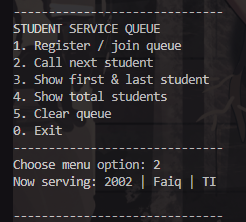

|            | Algorithm and Data Structure                 |
| ---------- | -------------------------------------------- |
| NIM        | 244107020214                                 |
| Nama       | Faiq Razzan Afifie                           |
| Kelas      | TI - 1I                                      |
| Repository | [link] (https://github.com/faiq191/JobSheet) |

# Labs #2 LINKED LIST

## 2.1 Experiment 1: Implementing Single Linked List

**Brief explanaton:**

This experiment involves implementing a Single Linked List (SLL) to store student data. The linked list consists of nodes connected by pointers to the next node.
Basic operations such as adding data at specific positions, printing all data, and inserting data after a certain node are demonstrated.
The temporary variable temp is used as a cursor to traverse the list without altering the head or tail pointers, maintaining the integrity of the list.
This implementation provides a foundational understanding of how linked lists function and how dynamic data manipulation is performed.

## 2.1.1 Verification Experiment Results


## 2.1.3 Questions

1. Why does compiling the program code result in the message "Linked List is Empty" on the
first line?

Because in the main() method, you call sll.print(); before any data is added to the list.
At that point, head == null, so isEmpty() returns true

2. Explain the general purpose of the variable temp in each method!

The variable temp is a temporary node reference used to traverse the linked list. It acts as a cursor or pointer that moves through the list without modifying the actual head or tail of the list. This allows safe navigation and manipulation of nodes.

Below is the explanation of temp in different methods:

print()
temp starts at head and iterates through each node to print its contents.

insertAfter(Student std, String key)
temp is used to find the node that contains the name matching the key. Once found, the new node is inserted right after temp.

insertAt(int index, Student std)
temp is used to move to the node just before the specified index, so the new node can be inserted in the correct position.

By using temp, we avoid altering the structure of the list while performing operations like printing, inserting, or searching. This keeps the list's structure intact and the code easier to manage.

3. Modify the code so that data can be added via keyboard input!

``` java
import java.util.Scanner;

public class SLLMain12 {
    public static void main(String[] args) {
        SingleLinkedList sll = new SingleLinkedList();
        Scanner sc = new Scanner(System.in);

        System.out.print("How many students to input? ");
        int n = sc.nextInt();
        sc.nextLine(); // clear newline

        for (int i = 0; i < n; i++) {
            System.out.println("Student #" + (i + 1));
            System.out.print("  NIM       : ");
            String nim = sc.nextLine();
            System.out.print("  Name      : ");
            String name = sc.nextLine();
            System.out.print("  Class     : ");
            String cls = sc.nextLine();
            System.out.print("  GPA       : ");
            double gpa = sc.nextDouble();
            sc.nextLine();

            Student std = new Student(nim, name, cls, gpa);
            sll.addLast(std); // or addFirst / insertAt depending on need
        }

        System.out.println();
        sll.print();
    }
}

```

Output:


4. What would happen if we did not use the tail attribute? Would it affect the code
implementation? Please explain.

Yes, it would affect performance and implementation in some methods:

🔹 Without tail:
addLast() would need to traverse the entire list from head to find the last node every time you want to insert at the end ⇒ O(n) time complexity instead of O(1).

In insertAfter(), when inserting after the last node, you wouldn’t know to update the last node unless you traverse the list again.

Some efficiency is lost, though the list will still function correctly.

🔹 With tail:
You always have direct access to the last node, making addLast() and similar operations much faster ⇒ O(1) time.

Conclusion:
The tail attribute is not strictly required but greatly improves performance, especially for frequent end insertions. It's a good design practice in singly linked lists.

## 2.2 Experiment 2:

**Brief explanaton:**

This experiment extends the linked list implementation by adding a method to remove a node based on a given key (e.g., student name).
The removal process searches for the target node and then links the previous node to the node after the one being removed, effectively deleting it from the list.
The break keyword is used to stop the loop once the target node is removed, preventing unnecessary iterations and improving efficiency.
Updating the tail pointer when the last node is removed ensures the linked list remains consistent and valid.
This experiment highlights the importance of pointer management in linked list operations, especially during deletion.

## 2.2.2 Verification


## 2.2.3 Questions

1. Why is the break keyword used in the remove function? Explain!

The break keyword is used in the remove(String key) method to exit the while loop once the target node (the one with the matching name) has been found and removed. This is important because:

The goal is to remove only the first occurrence of a node with the given key.

Without break, the loop would continue unnecessarily, possibly causing errors or removing unintended nodes.

It also improves performance by avoiding extra iteration after the task is done.

2. Explain the purpose of the code below in the remove method.
```java
temp.next = temp.next.next;
if (temp.next == null) {
tail = temp;
}
```

This code is responsible for removing a node that is not the head (i.e., in the middle or at the end):

temp.next = temp.next.next;
This line skips the node to be removed by redirecting the current node's .next pointer to the node after the target. It effectively deletes the target node from the list.

if (temp.next == null) { tail = temp; }
This condition checks if the removed node was the last node (the tail). If so, the tail reference is updated to point to the new last node (temp) to keep the linked list's structure accurate.

This ensures the linked list remains valid after a removal, especially when the last element is deleted.

## Assignment

Code:

```java
import java.util.Scanner;

public class StudentQueueApp {

    // === Student class ===
    static class Student {
        String id, name, major;

        Student(String id, String name, String major) {
            this.id = id;
            this.name = name;
            this.major = major;
        }

        @Override
        public String toString() {
            return id + " | " + name + " | " + major;
        }
    }

    // === Node class ===
    static class Node {
        Student data;
        Node next;

        Node(Student data) {
            this.data = data;
            this.next = null;
        }
    }

    // === Queue class implemented using Linked List ===
    static class StudentQueue {
        Node front, rear;
        int size;
        int capacity;  // -1 means unlimited

        StudentQueue(int capacity) {
            this.capacity = capacity <= 0 ? -1 : capacity;
            clear();
        }

        boolean isEmpty() {
            return size == 0;
        }

        boolean isFull() {
            return capacity != -1 && size == capacity;
        }

        void clear() {
            front = rear = null;
            size = 0;
        }

        int size() {
            return size;
        }

        boolean enqueue(Student s) {
            if (isFull()) return false;
            Node newNode = new Node(s);
            if (isEmpty()) {
                front = rear = newNode;
            } else {
                rear.next = newNode;
                rear = newNode;
            }
            size++;
            return true;
        }

        Student dequeue() {
            if (isEmpty()) return null;
            Student s = front.data;
            front = front.next;
            if (front == null) rear = null;
            size--;
            return s;
        }

        Student peekFront() {
            return isEmpty() ? null : front.data;
        }

        Student peekRear() {
            return isEmpty() ? null : rear.data;
        }
    }

    // === Main Program ===
    public static void main(String[] args) {
        Scanner sc = new Scanner(System.in);

        System.out.print("Maximum queue size (0 = unlimited): ");
        int cap = sc.nextInt();
        sc.nextLine();
        StudentQueue queue = new StudentQueue(cap);

        while (true) {
            showMenu();
            int choice = readInt(sc, "Choose menu option: ");

            switch (choice) {
                case 1 -> registerStudent(queue, sc);
                case 2 -> callNextStudent(queue);
                case 3 -> showFrontRear(queue);
                case 4 -> System.out.println("Total students in queue: " + queue.size());
                case 5 -> {
                    queue.clear();
                    System.out.println("Queue cleared.");
                }
                case 0 -> {
                    System.out.println("Good-bye!");
                    sc.close();
                    return;
                }
                default -> System.out.println("Invalid choice.");
            }
            System.out.println();
        }
    }

    static void showMenu() {
        System.out.println("""
                ------------------------------
                STUDENT SERVICE QUEUE
                1. Register / join queue
                2. Call next student
                3. Show first & last student
                4. Show total students
                5. Clear queue
                0. Exit
                ------------------------------""");
    }

    static int readInt(Scanner sc, String prompt) {
        System.out.print(prompt);
        while (!sc.hasNextInt()) {
            sc.next();
            System.out.print(prompt);
        }
        int x = sc.nextInt();
        sc.nextLine();
        return x;
    }

    static void registerStudent(StudentQueue q, Scanner sc) {
        if (q.isFull()) {
            System.out.println("Queue is full – cannot register.");
            return;
        }
        System.out.print("  Student ID  : ");
        String id = sc.nextLine();
        System.out.print("  Name        : ");
        String name = sc.nextLine();
        System.out.print("  Major/Class : ");
        String cls = sc.nextLine();

        boolean ok = q.enqueue(new Student(id, name, cls));
        System.out.println(ok ? "Student added to queue." : "Failed to add student.");
    }

    static void callNextStudent(StudentQueue q) {
        Student s = q.dequeue();
        if (s == null) {
            System.out.println("No students in queue.");
        } else {
            System.out.println("Now serving: " + s);
        }
    }

    static void showFrontRear(StudentQueue q) {
        if (q.isEmpty()) {
            System.out.println("Queue is empty.");
            return;
        }
        System.out.println("Front: " + q.peekFront());
        System.out.println("Rear : " + q.peekRear());
    }
}

```

Output:





