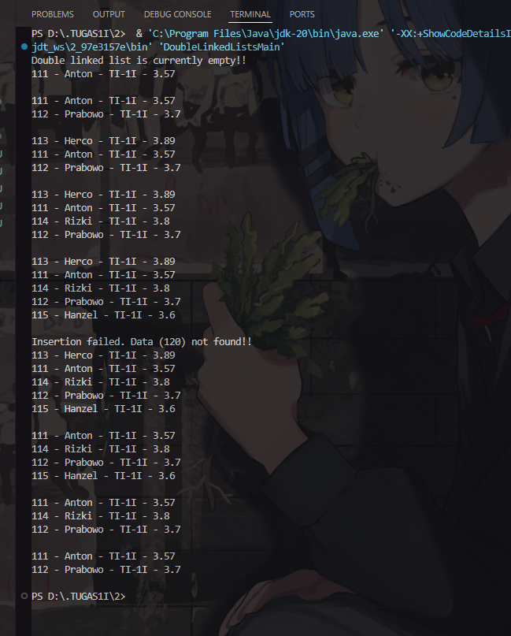
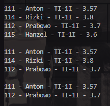

|            | Algorithm and Data Structure                 |
| ---------- | -------------------------------------------- |
| NIM        | 244107020214                                 |
| Nama       | Faiq Razzan Afifie                           |
| Kelas      | TI - 1I                                      |
| Repository | [link] (https://github.com/faiq191/JobSheet) |

# Double Linked Lists

### EXPERIMENT 1
## 12.2.2 Output Verification



## Question

1. Explain the difference between a singly linked list and a doubly linked list.
A singly linked list only has a pointer to the next node, so it can only be traversed in one direction (forward). Meanwhile, a doubly linked list has pointers to both the previous and next nodes, allowing two-way traversal (forward and backward).

2. Observe the Node class, which contains the attributes next and prev. What are the purposes of these attributes?
The 'next' attribute points to the next node, while 'prev' points to the previous node. These attributes allow nodes to be connected in both directions, enabling bidirectional traversal.

3. Examine the constructor in the DoubleLinkedLists class. What is the purpose of this constructor?
The constructor in DoubleLinkedLists initializes the list as empty by setting both 'head' and 'tail' to null. This ensures the list is in a clean state before any data is added.

4. In the addFirst() method, what is the meaning of the following code?
if(isEmpty()) { head = tail = newNode; }
This code checks if the list is empty. If it is, the new node becomes both the head and the tail since it is the only node in the list.

5. In the addFirst() method, what does the statement head.prev = newNode mean?
This statement sets the previous node of the old head to the new node, maintaining the backward link after the new node is added to the front.

6. In the insertAfter() method, what is the meaning of current.next.prev = newNode?
This means the node after the current node should now link back to the new node, maintaining the proper backward reference in the list.

7. In the experiment 1 code, in which method the traversal process implemented? What is the meaning of temp = temp.next ?
Traversal occurs in the 'insertAfter()' and 'print()' methods. The statement 'temp = temp.next' moves the pointer to the next node during traversal.

8. In the insertAfter() method, what is the following code for?
if(temp == tail) { addLast(data); }
This code handles the special case where the key is found at the tail. Since there is no node after the tail, we can just use 'addLast()' to add the new node. If we remove this part, inserting after the tail would not work.

9. In the insertAfter() method, what is this statement if(temp.data.nim.equalsIgnoreCase(key)) for?
This statement checks if the current node's 'nim' matches the specified key (case-insensitive). If it matches, the new node will be inserted after that node.


### EXPERIMENT 2
## 12.3.2 Output Verification



## Question

1. What is the use of the following statement in the removeFirst() method?
head = head.next;
head.prev = null;
2. Why is it important to include conditions and processes like the ones below in both
removeFirst() and removeLast() methods? Explain!
else if(head == tail){
head = tail = null;
}
3. In the removeLast() method, if there is no tail attribute inside DoubleLinkedLists
class, what approach or changes need to be made to the code of the method?
4. What is the purpose of the initial if(isEmpty()) check in the remove(int index)
method?
5. Explain how the method handles the removal of a node at the beginning (index ==
0) and at the end (temp == tail) of the linked list.
6. Describe how the method updates the links between nodes when removing a node
from the middle of the linked list.
7. The remove(int index) method currently does not check for negative index or index
that exceed the size of the DoubleLinkedLists. Please add statements to handle these
cases.

## 12.5 Assignments

Code:

``` java
public class DoubleLinkedLists {
    Node head;
    Node tail;

    public DoubleLinkedLists() {
        head = null;
        tail = null;
    }

    boolean isEmpty() {
        return head == null;
    }

    void addFirst(Student data) {
        Node newNode = new Node(data);
        if (isEmpty()) {
            head = tail = newNode;
        } else {
            newNode.next = head;
            head.prev = newNode;
            head = newNode;
        }
    }

    void addLast(Student data) {
        Node newNode = new Node(data);
        if (isEmpty()) {
            head = tail = newNode;
        } else {
            tail.next = newNode;
            newNode.prev = tail;
            tail = newNode;
        }
    }

    void add(Student data, int index) {
        if (index < 0 || index > getSize()) {
            System.out.println("Invalid index!");
            return;
        }
        if (index == 0) {
            addFirst(data);
        } else if (index == getSize()) {
            addLast(data);
        } else {
            Node temp = head;
            for (int i = 0; i < index; i++) {
                temp = temp.next;
            }
            Node newNode = new Node(temp.prev, data, temp);
            temp.prev.next = newNode;
            temp.prev = newNode;
        }
    }

    void insertAfter(String key, Student data) {
        Node temp = head;
        while (temp != null) {
            if (temp.data.nim.equalsIgnoreCase(key)) {
                if (temp == tail) {
                    addLast(data);
                } else {
                    Node newNode = new Node(data);
                    newNode.next = temp.next;
                    newNode.prev = temp;
                    temp.next.prev = newNode;
                    temp.next = newNode;
                }
                return;
            }
            temp = temp.next;
        }
        System.out.println("Insertion failed. Data (" + key + ") not found!!");
    }

    void removeAfter(String key) {
        Node temp = head;
        while (temp != null) {
            if (temp.data.nim.equalsIgnoreCase(key)) {
                if (temp.next == null) {
                    System.out.println("No node exists after the key!");
                    return;
                } else if (temp.next == tail) {
                    removeLast();
                } else {
                    temp.next = temp.next.next;
                    if (temp.next != null) {
                        temp.next.prev = temp;
                    }
                }
                return;
            }
            temp = temp.next;
        }
        System.out.println("Key not found!");
    }

    Student getFirst() {
        if (isEmpty()) return null;
        return head.data;
    }

    Student getLast() {
        if (isEmpty()) return null;
        return tail.data;
    }

    Student getIndex(int index) {
        if (index < 0 || index >= getSize()) return null;
        Node temp = head;
        for (int i = 0; i < index; i++) {
            temp = temp.next;
        }
        return temp.data;
    }

    int getSize() {
        int count = 0;
        Node temp = head;
        while (temp != null) {
            count++;
            temp = temp.next;
        }
        return count;
    }

    int indexOf(String nim) {
        int index = 0;
        Node temp = head;
        while (temp != null) {
            if (temp.data.nim.equalsIgnoreCase(nim)) {
                return index;
            }
            index++;
            temp = temp.next;
        }
        return -1; // not found
    }

    void print() {
        if (!isEmpty()) {
            Node temp = head;
            while (temp != null) {
                temp.data.print();
                temp = temp.next;
            }
            System.out.println("");
        } else {
            System.out.println("Double linked list is currently empty!!");
        }
    }

    void removeFirst() {
        if (isEmpty()) {
            System.out.println("Double linked list is currently empty!!");
        } else if (head == tail) {
            head = tail = null;
        } else {
            head = head.next;
            head.prev = null;
        }
    }

    void removeLast() {
        if (isEmpty()) {
            System.out.println("Double linked list is currently empty!!");
        } else if (head == tail) {
            head = tail = null;
        } else {
            tail = tail.prev;
            tail.next = null;
        }
    }

    void remove(int index) {
        if (isEmpty()) {
            System.out.println("Double linked list is currently empty!!");
        } else if (index < 0 || index >= getSize()) {
            System.out.println("Invalid index!!");
        } else if (index == 0) {
            removeFirst();
        } else {
            Node temp = head;
            for (int i = 0; i < index; i++) {
                temp = temp.next;
            }
            if (temp == tail) {
                removeLast();
            } else {
                temp.prev.next = temp.next;
                temp.next.prev = temp.prev;
            }
        }
    }
}
```

