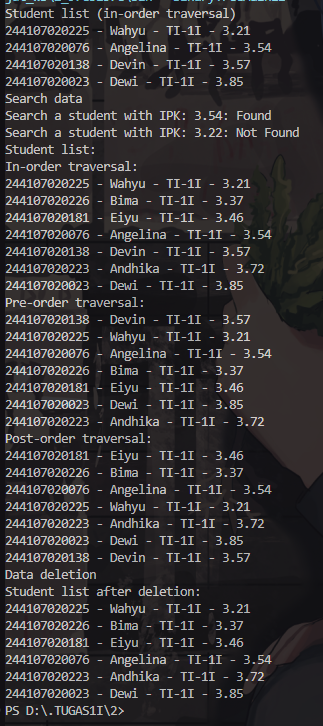
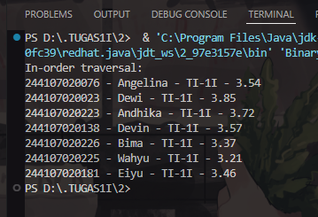

|            | Algorithm and Data Structure                 |
| ---------- | -------------------------------------------- |
| NIM        | 244107020214                                 |
| Nama       | Faiq Razzan Afifie                           |
| Kelas      | TI - 1I                                      |
| Repository | [link] (https://github.com/faiq191/JobSheet) |

# Tree

### EXPERIMENT 1
## Output Verification



## Question

1. Why is data search in a binary search tree more efficient compared to a regular binary tree?

Answer:
Because in a binary search tree (BST), the data is organized such that:
- Left child < parent < right child
This makes it possible to ignore half of the tree when searching (like binary search),
resulting in faster search compared to a regular binary tree where data is not ordered.

------------------------------------------------------------

2. What are the purposes of the left and right attributes in the Node class?

Answer:
The left and right attributes are references to the left and right child nodes.
They are used to form the structure of the binary tree and allow traversal
or insertion/deletion of nodes in the left or right subtree.

------------------------------------------------------------

3a. What is the function of the root attribute in the BinaryTree class?

Answer:
The root attribute is the starting point or top node of the binary tree.
All operations like add, delete, and traverse start from the root.

3b. When a BinaryTree object is first created, what is the initial value of root?

Answer:
The initial value of root is null, which means the tree is empty.

------------------------------------------------------------

4. When the tree is empty and a new node is to be added, what process takes place?

Answer:
If the tree is empty (root is null), the new node becomes the root node of the tree.

------------------------------------------------------------

5. Consider the following line of code inside the add() method. Explain in detail the purpose of this line of code.

if(data.ipk < current.data.ipk){
    if(current.left != null){
        current = current.left;
    } else {
        current.left = new Node00(data);
        break;
    }
} else if(data.ipk > current.data.ipk){
    if(current.right != null){
        current = current.right;
    } else {
        current.right = new Node00(data);
        break;
    }
}

Answer:
This code compares the IPK of the new student with the current node's IPK:
- If smaller, it moves left (current = current.left)
- If greater, it moves right (current = current.right)
- If the left/right is null, it means that is the correct place to insert the new node,
  so it creates and assigns the new node there.

------------------------------------------------------------

6. Explain the steps involved in the delete() method when removing a node that has two children.
How does the getSuccessor() method assist in this process?

Answer:
- First, locate the node to delete.
- If it has two children, find the in-order successor (smallest node in the right subtree).
- Replace the node's data with the successor's data.
- Delete the successor node from its original position (handled by getSuccessor()).
- getSuccessor() helps find and adjust the correct replacement node.


### EXPERIMENT 2
## Output Verification



## Question

1. What is the purpose of the data and idxLast attributes in the BinaryTreeArray class?

Answer:
- data: adalah array yang menyimpan objek-objek Student sebagai elemen pohon biner.
- idxLast: menunjukkan indeks terakhir yang terisi di dalam array, berguna untuk membatasi traversal.

------------------------------------------------------------

2. What is the function of the populateData() method?

Answer:
populateData() digunakan untuk mengisi array data dengan elemen-elemen Student
dan mengatur nilai idxLast sesuai jumlah elemen. Ini adalah proses inisialisasi isi pohon.

------------------------------------------------------------

3. What is the purpose of the traverseInOrder() method?

Answer:
traverseInOrder() digunakan untuk melakukan penelusuran in-order (kiri, root, kanan)
pada pohon biner yang disimpan dalam bentuk array. Metode ini mencetak data dalam urutan terurut.

------------------------------------------------------------

4. If a binary tree node is stored at index 2 in the array, at which indices are its left and right
children located, respectively?

Answer:
- Left child = 2 * 2 + 1 = index 5
- Right child = 2 * 2 + 2 = index 6

------------------------------------------------------------

5. What is the purpose of the statement int idxLast = 6 in Experiment 2, step 4?

Answer:
idxLast = 6 menunjukkan bahwa indeks terakhir yang berisi data adalah index ke-6
(artinya array memiliki 7 elemen dari indeks 0 sampai 6). Ini digunakan agar traversal
tidak melampaui batas data yang tersedia.

------------------------------------------------------------

6. Why are the indices 2 * idxStart + 1 and 2 * idxStart + 2 used in the recursive calls, and how do
they relate to the structure of a binary tree represented as an array?

Answer:
Karena dalam representasi pohon biner menggunakan array:
- Anak kiri dari node di index i = 2 * i + 1
- Anak kanan dari node di index i = 2 * i + 2

Ini adalah aturan umum dalam representasi heap/binary tree di array.
Aturan ini menjaga struktur pohon agar dapat diakses tanpa pointer.

## 14.4 Assignments

Assignment 14.4 – Answers

1. Implement a recursive method addRekursif() in the BinaryTree00 class to add nodes recursively.

Answer:
The addRekursif() method adds nodes recursively into the binary search tree.
It uses a helper function addRekursifRecursive() to traverse the tree until it finds
the correct position based on the student's GPA (IPK).

Code:
```java
public void addRekursif(Student12 data) {
    root = addRekursifRecursive(root, data);
}

private Node12 addRekursifRecursive(Node12 current, Student12 data) {
    if (current == null) return new Node12(data);

    if (data.ipk < current.data.ipk)
        current.left = addRekursifRecursive(current.left, data);
    else if (data.ipk > current.data.ipk)
        current.right = addRekursifRecursive(current.right, data);

    return current;
}
```

------------------------------------------------------------

2. Create methods getMinIPK() and getMaxIPK() in the BinaryTree00 class to retrieve and display
the student data with the lowest and highest GPA(IPK) values stored in the binary search tree.

Answer:
- getMinIPK() walks left until it finds the leftmost node (minimum GPA).
- getMaxIPK() walks right until it finds the rightmost node (maximum GPA).

Code:
```java
public Student12 getMinIPK() {
    if (isEmpty()) return null;
    Node12 current = root;
    while (current.left != null) current = current.left;
    return current.data;
}

public Student12 getMaxIPK() {
    if (isEmpty()) return null;
    Node12 current = root;
    while (current.right != null) current = current.right;
    return current.data;
}
```

------------------------------------------------------------

3. Develop a method displayStudentsWithIPKAbove(double threshold) in the BinaryTree00 class
to display student data whose GPA(IPK) exceeds a specified threshold.

Answer:
This method traverses the tree in-order and prints only the students
with GPA higher than the given threshold.

Code:
```java
public void displayStudentsWithIPKAbove(double threshold) {
    displayAbove(root, threshold);
}

private void displayAbove(Node12 node, double threshold) {
    if (node != null) {
        displayAbove(node.left, threshold);
        if (node.data.ipk > threshold) node.data.print();
        displayAbove(node.right, threshold);
    }
}
```

------------------------------------------------------------

4. Modify the BinaryTreeArray00 class by adding the following methods:
→ add(Student data)
→ traversePreOrder()

Answer:
- The add() method adds a Student to the array as the next available node.
- traversePreOrder() prints data using root-left-right order recursively.

Code:
``` java
public void add(Student12 student) {
    if (idxLast + 1 < data.length) {
        idxLast++;
        data[idxLast] = student;
    } else {
        System.out.println("Tree array is full!");
    }
}

public void traversePreOrder(int idxStart) {
    if (idxStart <= idxLast && data[idxStart] != null) {
        data[idxStart].print();
        traversePreOrder(2 * idxStart + 1);
        traversePreOrder(2 * idxStart + 2);
    }
}
```

------------------------------------------------------------
