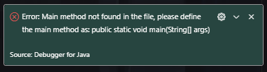
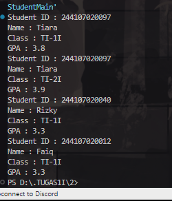

|            | Algorithm and Data Structure                 |
| ---------- | -------------------------------------------- |
| NIM        | 244107020214                                 |
| Nama       | Faiq Razzan Afifie                           |
| Kelas      | TI - 1I                                      |
| Repository | [link] (https://github.com/faiq191/JobSheet) |

# Labs #2 Class and Object

## 2.1 Experiment 1: Declaring Classes, Attributes, and Methods

**Brief explanaton:**

1. Create a Java file: Name it Student<NoAbsen>.java.
2. Define attributes: Declare studentID, name, className, and gpa as instance variables.
3. Implement methods:
   1. print(): Displays student details.
   2. changeClass(newClass): Updates className.
   3. updateGpa(newGpa): Updates gpa.
   4. evaluate(): Returns performance status based on gpa.
4. Compile and Run: Verify if the output matches expectations.

The solution is implemented in Student12.java, and below is screenshot of the result.

## 2.1.2 Verification Experiment Results



## 2.1.3 Questions

1. Two characteristics of a class or object:
   - Attributes (State): Defines the properties of an object (e.g., studentID, name, etc.).
   - Methods (Behavior): Defines what an object can do (e.g., print(), changeClass(), etc.).
2. Attributes of the Student12 class:
   - studentID (String)
   - name (String)
   - className (String)
   - gpa (double)
3. Methods of the Student12 class:
   - print()
   - changeClass(String newClass)
   - updateGPA(double newGPA)
   - evaluate()
4. Modified updateGPA() method with validation:
   
5. Explanation of the evaluate() method:

- It evaluates student performance based on GPA (gpa).
- Criteria used:
  - gpa >= 3.5 → "Excellent"
  - gpa >= 3.0 → "Good"
  - gpa >= 2.0 → "Fair"
  - gpa < 2.0 → "Poor"
- It returns a String representing the performance level.

## 2.2 Experiment 2: Object Instantiation and Accessing Attributes and Methods

**Brief explanaton:**

1. Creates an instance of `Student12`:
   Student12 student1 = new Student12();

   - A new `Student12` object named `student1` is created.

2. Assigns values to attributes:
   student1.studentID = "244107020097";
   student1.name = "Tiara";
   student1.className = "TI-1I";
   student1.gpa = 3.8;

   - The student's ID, name, class, and GPA are set.

3. Prints student details:
   student1.print();

   - Calls the `print()` method to display student information.

4. Changes class and updates GPA:
   student1.changeClass("TI-2I");
   student1.updateGPA(3.9);

   - The student's class is changed to `"TI-2I"`.
   - The student's GPA is updated to `3.9`.

5. Prints updated student details:
   student1.print();
   - Calls the `print()` method again to show the updated details.

The solution is implemented in StudentMain.java, and below is screenshot of the result.

## 2.2.2 Verification of Experiment Results:


## 2.2.3 Questions

1. Line of code used for instantiation:
   Student12 student1 = new Student12();

   - The name of the created object is `student1`.

2. Accessing attributes and methods of an object:

   - Attributes: objectName.attributeName;
     Example: student1.name = "Tiara";
   - Methods: objectName.methodName();
     Example: student1.print();

3. Difference in output between the first and second calls to print():
   - The first call to `print()` displays the initial values of the student.
   - The second call to `print()` displays updated values after `changeClass("TI-2I")` and `updateGPA(3.9)` are executed.

## 2.3 Experiment 3: Creating Constructor

**Brief explanaton:**
1. A Student object named student2 is created using the parameterized constructor.  
2. The constructor initializes studentID, name, className, and gpa with the given values.  
3. The updateGPA method updates the GPA from 3.5 to 3.3.  
4. The print method displays the updated student details.  

The solution is implemented in Student12.java, and below is screenshot of the result.

## 2.3.2 Verification of Experiment Results:



## 2.3.3 Questions

1. The line of code in Student12 used to declare the parameterized constructor:

   ```java
   public Student12(String id, String name, String cls, double gpa) {
       studentID = id;
       this.name = name;
       className = cls;
       this.gpa = gpa;
   }
   ```

2. The following line of code in StudentMain:

   ```java
   Student12 student2 = new Student12("244107020040", "Rizky", "TI-1I", 3.5);
   ```

   This line creates a new object named `student2` of the `Student12` class, initializing it with the values:

   - `studentID = "244107020040"`
   - `name = "Rizky"`
   - `className = "TI-1I"`
   - `gpa = 3.5`

   It calls the parameterized constructor to assign these values.

3. Removing the default constructor and compiling:
   - The program will fail to compile with an error: `constructor Student12 in class Student12 cannot be applied to given types`.
   - This happens because the no-argument constructor (`public Student12() {}`) is removed, but `student1` is instantiated without arguments in `StudentMain`. Since only a parameterized constructor exists, Java does not provide a default constructor automatically.
4. Methods in Student12 do not need to be accessed in order.
   - Each method in `Student12` is independent and can be called in any order based on the program's logic.
   - For example, `print()` can be called before or after `changeClass()` or `updateGPA()`, and the object's state will reflect the latest modifications.
5. Creating a new object `studentFaiq` using the parameterized constructor:

   ```java
        Student12 studentFaiq = new Student12("244107020012", "Faiq", "TI-1I", 3.7);
        studentFaiq.updateGPA(3.3);
        studentFaiq.print();
   ```


## 2.4 Assignment 1

The solution is implemented in Lecturer12.java and LecturerMain12.java and below is screenshot of the result.

**Class Code**

 ```java
class Lecturer12 {
    private String lecturerID;
    private String name;
    private boolean status;
    private int startYear;
    private String expertiseField;

    public Lecturer12() {
        this.lecturerID = "Unknown";
        this.name = "Unknown";
        this.status = false;
        this.startYear = 0;
        this.expertiseField = "Unknown";
    }

    public Lecturer12(String lecturerID, String name, boolean status, int startYear, String expertiseField) {
        this.lecturerID = lecturerID;
        this.name = name;
        this.status = status;
        this.startYear = startYear;
        this.expertiseField = expertiseField;
    }

    public void print() {
        System.out.println("Lecturer ID: " + lecturerID);
        System.out.println("Name: " + name);
        System.out.println("Status: " + (status ? "Active" : "Inactive"));
        System.out.println("Start Year: " + startYear);
        System.out.println("Expertise Field: " + expertiseField);
    }

    public void setStatus(boolean status) {
        this.status = status;
        System.out.println("Status updated to: " + (status ? "Active" : "Inactive"));
    }

    public int calculateTenure(int yearNow) {
        return yearNow - this.startYear;
    }

    public void changeExpertiseField(String newField) {
        this.expertiseField = newField;
        System.out.println("Expertise Field updated to: " + newField);
    }
}
 ```

 **Main Code**

 ```java
 public class CourseMain12 {
    public static void main(String[] args) {
        Course12 course1 = new Course12();
        Course12 course2 = new Course12("CS101", "Data Structures", 3, 4);

        System.out.println("\nDefault Course:");
        course1.print();

        System.out.println("\nParameterized Course:");
        course2.print();

        System.out.println("\nUpdating Course Details:");
        course2.changeCredit(4);
        course2.addHour(2);
        course2.reduceHour(3);
    }
}
```

 **Output**

 

 ## 2.4 Assignment 2

 **Class Code**

 ```java
class Course12 {
    private String courseID;
    private String name;
    private int credit;
    private int hour;

    public Course12() {
        this.courseID = "Unknown";
        this.name = "Unknown";
        this.credit = 0;
        this.hour = 0;
    }

    public Course12(String courseID, String name, int credit, int hour) {
        this.courseID = courseID;
        this.name = name;
        this.credit = credit;
        this.hour = hour;
    }

    public void print() {
        System.out.println("Course ID: " + courseID);
        System.out.println("Name: " + name);
        System.out.println("Credit: " + credit);
        System.out.println("Hour: " + hour);
    }

    public void changeCredit(int newCredit) {
        this.credit = newCredit;
        System.out.println("Credit updated to: " + newCredit);
    }

    public void addHour(int hour) {
        this.hour += hour;
        System.out.println("Hours increased by " + hour + ", total hours: " + this.hour);
    }

    public void reduceHour(int hour) {
        if (this.hour - hour >= 0) {
            this.hour -= hour;
            System.out.println("Hours reduced by " + hour + ", total hours: " + this.hour);
        } else {
            System.out.println("Reduction not possible. Remaining hours: " + this.hour);
        }
    }
}
 ```

 **Main Code**

 ```java
public class LecturerMain12 {
    public static void main(String[] args) {
        Lecturer12 lecturer1 = new Lecturer12();
        Lecturer12 lecturer2 = new Lecturer12("L001", "Dr. John Doe", true, 2010, "Computer Science");

        System.out.println("\nDefault Lecturer:");
        lecturer1.print();

        System.out.println("\nParameterized Lecturer:");
        lecturer2.print();

        System.out.println("\nUpdating Lecturer Details:");
        lecturer2.setStatus(false);
        System.out.println("Tenure: " + lecturer2.calculateTenure(2024) + " years");
        lecturer2.changeExpertiseField("Artificial Intelligence");
    }
}

```

 **Output**

 

