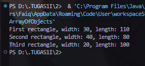
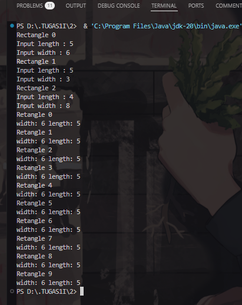
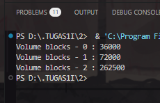
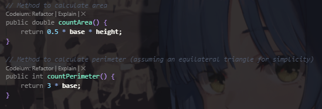
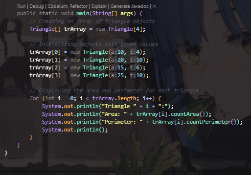
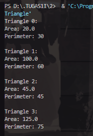
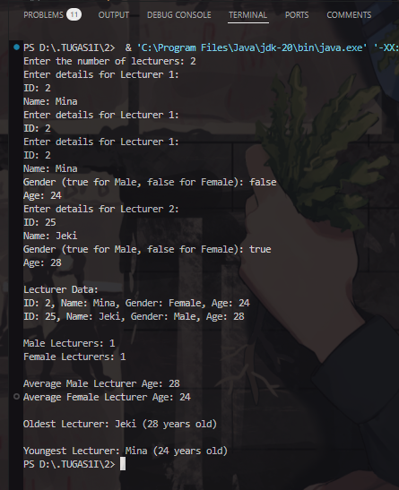

|            | Algorithm and Data Structure                 |
| ---------- | -------------------------------------------- |
| NIM        | 244107020214                                 |
| Nama       | Faiq Razzan Afifie                           |
| Kelas      | TI - 1I                                      |
| Repository | [link] (https://github.com/faiq191/JobSheet) |

# Labs #3 Class and Object

## 1.2 Create, insert, and display Array of Object

**Brief explanaton:**

1. Create a Java file: Name it Student<NoAbsen>.java.
2. Define attributes: Declare studentID, name, className, and gpa as instance variables.
3. Implement methods:
   1. print(): Displays student details.
   2. changeClass(newClass): Updates className.
   3. updateGpa(newGpa): Updates gpa.
   4. evaluate(): Returns performance status based on gpa.
4. Compile and Run: Verify if the output matches expectations.

The solution is implemented in ArrayOfObjects.java, Rectangle.java and below is screenshot of the result.

## 1.2.2 Result



## 1.2.3 Questions

1. No, a class used as an array of objects does not necessarily need attributes and methods. However, attributes store data related to each object, and methods define behaviors. Without attributes, objects may not hold meaningful data, and without methods, they may lack functionality.

2. No, the Rectangle class does not have a constructor. However, we instantiate objects using `new Rectangle();` because Java provides a default constructor if no constructor is explicitly defined. This default constructor initializes objects without setting any attribute values.

3. The line `Rectangle[] rectangleArray = new Rectangle[3];` declares an array named `rectangleArray` that can hold references to three Rectangle objects. However, it only allocates memory for the array, not for the individual objects.

4. The lines:
   `rectangleArray[1] = new Rectangle();`
   `rectangleArray[1].length = 80;`
   `rectangleArray[1].width = 40;`

   - `rectangleArray[1] = new Rectangle();` creates a new Rectangle object and assigns it to index 1 of the array.
   - `rectangleArray[1].length = 80;` assigns the value 80 to the `length` attribute of the object at index 1.
   - `rectangleArray[1].width = 40;` assigns the value 40 to the `width` attribute of the object at index 1.

5. The `ArrayOfObjects` class and `Rectangle` class should be separated for better organization and reusability. `Rectangle` serves as a blueprint for creating objects, while `ArrayOfObjects` demonstrates how to use those objects. This separation follows the object-oriented programming principle of modularity.

## 1.3 Input data into Array of Objects using Loops

**Brief explanaton:**

1. A `Scanner` object is created to take user input.
2. A `Rectangle` array of size 3 is initialized.
3. A loop iterates 3 times to get user input for `length` and `width` for each `Rectangle` object.
4. A second loop attempts to print 10 rectangles, but it incorrectly accesses only `rectangleArray[0]` each time.
5. This results in printing the same width and length repeatedly, causing incorrect output.

The solution is implemented in ArrayOfObjects.java and below is screenshot of the result.

## 1.3.2 Result



## 1.3.3 Questions

1. Yes, an array of objects can be implemented using a 2D array. However, it depends on how we define and use the objects in the 2D array.
2. Example:
   ```java
   class Square {
       int side;
       Square(int side) {
           this.side = side;
       }
   }

   public class Main {
       public static void main(String[] args) {
           Square[][] squareGrid = new Square[2][2];
           squareGrid[0][0] = new Square(5);
           squareGrid[0][1] = new Square(10);
           squareGrid[1][0] = new Square(15);
           squareGrid[1][1] = new Square(20);

           System.out.println("Side of square at [1][1]: " + squareGrid[1][1].side);
       }
   }
   ```
3. The error occurs because the array of objects is only declared but not instantiated. The array squareArray contains null references, so accessing squareArray[5].side results in a NullPointerException.
4. Modified code to take array length from user input:

   ```java
   import java.util.Scanner;

   class Square {
       int side;
   }

   public class Main {
       public static void main(String[] args) {
           Scanner scanner = new Scanner(System.in);
           System.out.print("Enter the number of squares: ");
           int n = scanner.nextInt();
           
           Square[] squareArray = new Square[n];
           for (int i = 0; i < n; i++) {
               squareArray[i] = new Square(); // Instantiate each object
           }

           squareArray[5].side = 20; // This will not cause an error now
           System.out.println("Side of square at index 5: " + squareArray[5].side);
       }
   }
   ```
5. Yes, we can duplicate the instantiation process in an array of objects. If we assign the object in ppArray[i] and then reassign ppArray[0], the previous reference in ppArray[0] will be lost if it is not stored elsewhere. The effect is that the original object referenced by ppArray[0] may become unreachable and subject to garbage collection.

## 1.4 Mathematical operation in array of object’s attribute

**Brief explanaton:**

1. The `Blocks` class represents a block with three attributes: width, length, and height.
2. The constructor initializes these attributes with given values.
3. The `countVolume()` method calculates and returns the volume (length * width * height).
4. In `ArrayBlocks`, an array of `Blocks` objects (`blArray`) is created with a size of 3.
5. Three `Blocks` objects are instantiated and assigned to the array.
6. A loop iterates through the array, calling `countVolume()` to compute and print each block’s volume.

The solution is implemented in Blocks.java, ArrayBlocks.java and below is screenshot of the result.

## 1.4.2 Result



## 1.4.3 Questions

1. Yes, we can have multiple constructors in a class in Java. This is called constructor overloading, where multiple constructors have the same name but different parameters. This allows us to create objects in different ways.
2. Triangle class:

3. Method countArea() and countPerimeter() 

4. Instantiate array of Triangle objects

5. Display the result


## 1.5 Assignment

Number 1-2 and the output

```java
import java.util.Scanner;

class Lecturer {
    String id, name;
    boolean gender; // true for Male, false for Female
    int age;

    public Lecturer(String id, String name, boolean gender, int age) {
        this.id = id;
        this.name = name;
        this.gender = gender;
        this.age = age;
    }
}

class LecturerData {
    public static void showAllLecturerData(Lecturer[] lecturerArray) {
        for (Lecturer lecturer : lecturerArray) {
            System.out.println("ID: " + lecturer.id + ", Name: " + lecturer.name + ", Gender: " + (lecturer.gender ? "Male" : "Female") + ", Age: " + lecturer.age);
        }
    }

    public static void countLecturerByGender(Lecturer[] lecturerArray) {
        int maleCount = 0, femaleCount = 0;
        for (Lecturer lecturer : lecturerArray) {
            if (lecturer.gender) maleCount++;
            else femaleCount++;
        }
        System.out.println("Male Lecturers: " + maleCount);
        System.out.println("Female Lecturers: " + femaleCount);
    }

    public static void averageLecturerAgeByGender(Lecturer[] lecturerArray) {
        int maleTotalAge = 0, femaleTotalAge = 0, maleCount = 0, femaleCount = 0;
        for (Lecturer lecturer : lecturerArray) {
            if (lecturer.gender) {
                maleTotalAge += lecturer.age;
                maleCount++;
            } else {
                femaleTotalAge += lecturer.age;
                femaleCount++;
            }
        }
        System.out.println("Average Male Lecturer Age: " + (maleCount == 0 ? "N/A" : (maleTotalAge / maleCount)));
        System.out.println("Average Female Lecturer Age: " + (femaleCount == 0 ? "N/A" : (femaleTotalAge / femaleCount)));
    }

    public static void showOldestLecturerInfo(Lecturer[] lecturerArray) {
        Lecturer oldest = lecturerArray[0];
        for (Lecturer lecturer : lecturerArray) {
            if (lecturer.age > oldest.age) oldest = lecturer;
        }
        System.out.println("Oldest Lecturer: " + oldest.name + " (" + oldest.age + " years old)");
    }

    public static void showYoungestLecturerInfo(Lecturer[] lecturerArray) {
        Lecturer youngest = lecturerArray[0];
        for (Lecturer lecturer : lecturerArray) {
            if (lecturer.age < youngest.age) youngest = lecturer;
        }
        System.out.println("Youngest Lecturer: " + youngest.name + " (" + youngest.age + " years old)");
    }
}

public class LecturerDemo {
    public static void main(String[] args) {
        Scanner scanner = new Scanner(System.in);
        System.out.print("Enter the number of lecturers: ");
        int n = scanner.nextInt();
        scanner.nextLine();

        Lecturer[] lecturers = new Lecturer[n];

        for (int i = 0; i < n; i++) {
            System.out.println("Enter details for Lecturer " + (i + 1) + ":");
            System.out.print("ID: ");
            String id = scanner.nextLine();
            System.out.print("Name: ");
            String name = scanner.nextLine();
            System.out.print("Gender (true for Male, false for Female): ");
            boolean gender = scanner.nextBoolean();
            System.out.print("Age: ");
            int age = scanner.nextInt();
            scanner.nextLine();
            lecturers[i] = new Lecturer(id, name, gender, age);
        }
        scanner.close();

        System.out.println("\nLecturer Data:");
        LecturerData.showAllLecturerData(lecturers);
        System.out.println();
        LecturerData.countLecturerByGender(lecturers);
        System.out.println();
        LecturerData.averageLecturerAgeByGender(lecturers);
        System.out.println();
        LecturerData.showOldestLecturerInfo(lecturers);
        System.out.println();
        LecturerData.showYoungestLecturerInfo(lecturers);
    }
}
```

**Output**

