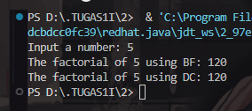
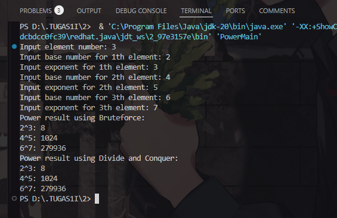
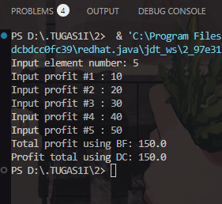
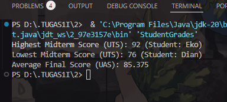

|            | Algorithm and Data Structure                 |
| ---------- | -------------------------------------------- |
| NIM        | 244107020214                                 |
| Nama       | Faiq Razzan Afifie                           |
| Kelas      | TI - 1I                                      |
| Repository | [link] (https://github.com/faiq191/JobSheet) |

# Labs #5 BRUTE FORCE AND DIVIDE CONQUER

## 5.2.1. Experiment Steps

**Brief explanaton:**

1. Create a new project named "BruteForceDivideConquer" and a package "week5".
2. Create a class named "Factorial".
3. Implement "factorialBF()" method using Brute Force (loop-based).
4. Implement "factorialDC()" method using Divide and Conquer (recursive).
5. Create a new class "MainFactorial" and inside it:
   - Define "main()" function.
   - Take user input for the factorial calculation.
   - Create an object of "Factorial" and call both "factorialBF()" & "factorialDC()".
6. Ensure there are no errors when running the program.

The solution is implemented in Factorial.java, MainFactorial.java and below is screenshot of the result.

## 5.2.2. Verification of Experiment Results



## 5.2.3. Questions

1. Difference in if and else structure in factorialDC():
   - The `if (n == 1)` part is the base case, which directly returns 1 without further recursion.
   - The `else` part is the recursive case, where `n` is multiplied by the result of factorialDC(n - 1), 
     repeatedly calling itself until reaching the base case.

2. Using an alternative to the for loop in factorialBF():
   Yes, a while loop can be used instead. Example:
   int factorialBF(int n) {
    ```java
       int facto = 1;
       int i = 1;
       while (i <= n) {
           facto *= i;
           i++;
       }
       return facto;
       ``
   }

3. Difference between `facto = facto * i;` and `int facto = n * factorialDC(n-1);`:
   - `facto = facto * i;` is used in iteration (factorialBF), where `facto` is updated each time in the loop.
   - `int facto = n * factorialDC(n-1);` is used in recursion (factorialDC), where `facto` is declared 
     in each recursive call and depends on the result of the previous recursive call.

4. Conclusion on factorialBF() vs factorialDC():
   - factorialBF() (Brute Force / Iterative): Uses a loop to compute the factorial from 1 to `n`. 
     It is more memory-efficient as it does not use recursion stack.
   - factorialDC() (Divide and Conquer / Recursive): Calls itself until reaching the base case. 
     It is more elegant mathematically but can cause a stack overflow if `n` is too large due to excessive recursion.

Conclusion: The iterative method is more efficient in terms of memory and safer for large `n`, 
whereas the recursive method is more conceptually elegant but has recursion depth limitations.

## 5.3.1. Experiment Steps

**Brief explanaton:**

1. Create a new class "Power" in the "week5" package.
2. Define attributes for "baseNumber" and "exponent".
3. Add a parameterized constructor to initialize values.
4. Implement "powerBF()" method using Brute Force (loop-based).
5. Implement "powerDC()" method using Divide and Conquer (recursive).
6. Create a new class "PowerMain" and inside it:
   - Take user input for the number of elements to calculate exponentiation.
   - Instantiate an array of objects storing base numbers & their exponents.
   - Call "powerBF()" and "powerDC()" methods for calculations.
7. Verify that the output matches the expected results.

The solution is implemented in Power.java, PowerMain.java and below is screenshot of the result.

## 5.3.2. Verification of Experiment Results



## 5.3.3. Questions

1. Differences between powerBF() and powerDC():
   - powerBF() (Brute Force Method): Uses an iterative loop to multiply the base by itself `e` times. Time complexity: O(e).
   - powerDC() (Divide and Conquer Method): Uses recursion to divide the problem into smaller subproblems. Time complexity: O(log e).

2. Does the combine stage exist in powerDC()? 
   Yes, it exists in the recursive method when combining results:
   - If e is odd: return (powerDC(n, e/2) * powerDC(n, e/2) * n);
   - If e is even: return (powerDC(n, e/2) * powerDC(n, e/2));

3. Relevance of parameters in powerBF():
   - The method already has class attributes baseNumber and exponent.
   - The method can be rewritten without parameters as follows:

     ```java
     int powerBF() {
         int result = 1;
         for(int i = 0; i < exponent; i++) {
             result = result * baseNumber;
         }
         return result;
     }
     ```

4. Summary of how powerBF() and powerDC() work:
   - powerBF(): Uses a loop to multiply the base `e` times.
   - powerDC(): Recursively divides the exponent and multiplies the results, reducing the number of operations.

## 5.4.1. Experiment Steps

**Brief explanaton:**

1. Create a new class "Sum" in the "week5" package.
2. Define a parameterized constructor to initialize the array of profits.
3. Implement "totalBF()" method using Brute Force (iterative sum).
4. Implement "totalDC()" method using Divide and Conquer (recursive sum).
5. Create a new class "SumMain" and inside it:
   - Allow the user to input the number of months for profit calculation.
   - Instantiate a "Sum" object and assign profits to each array element.
   - Call both "totalBF()" and "totalDC()" methods for sum calculation.
6. Verify the output is correct and matches expected results.

The solution is implemented in Sum.java, SumMain.java and below is screenshot of the result.

## 5.4.2. Verification of Experiment Results



## 5.4.3. Questions

1. The mid variable is used to divide the array into two halves for the divide-and-conquer approach.

2. `double lsum = totalDC(arr, l, mid);` recursively computes the sum of the left half of the array.
   `double rsum = totalDC(arr, mid+1, r);` recursively computes the sum of the right half of the array.

3. Summing lsum and rsum combines the results of the left and right subarrays to obtain the total sum of the array.

4. The base case occurs when `l == r`, meaning the subarray has only one element, and the method returns `arr[l]`.

5. The method divides the array into smaller parts, recursively computes the sum of each part, and then combines the results, making it more efficient than the brute-force approach.

## 5.5. Assignments

Code Student.java & StudentGrades.java
```java
class Student {
    String name;
    String studentID;
    int yearOfAdmission;
    int midtermScore;
    int finalScore;

    Student(String name, String studentID, int yearOfAdmission, int midtermScore, int finalScore) {
        this.name = name;
        this.studentID = studentID;
        this.yearOfAdmission = yearOfAdmission;
        this.midtermScore = midtermScore;
        this.finalScore = finalScore;
    }
}

public class StudentGrades {
    Student[] students = {
        new Student("Ahmad", "220101001", 2022, 78, 82),
        new Student("Budi", "220101002", 2022, 85, 88),
        new Student("Cindy", "220101003", 2021, 90, 87),
        new Student("Dian", "220101004", 2021, 76, 79),
        new Student("Eko", "220101005", 2023, 92, 95),
        new Student("Fajar", "220101006", 2020, 88, 85),
        new Student("Gina", "220101007", 2023, 80, 83),
        new Student("Hadi", "220101008", 2020, 82, 84)
    };

    Student findMax(int l, int r) {
        if (l == r) {
            return students[l];
        }
        int mid = (l + r) / 2;
        Student leftMax = findMax(l, mid);
        Student rightMax = findMax(mid + 1, r);
        return (leftMax.midtermScore >= rightMax.midtermScore) ? leftMax : rightMax;
    }

    Student findMin(int l, int r) {
        if (l == r) {
            return students[l];
        }
        int mid = (l + r) / 2;
        Student leftMin = findMin(l, mid);
        Student rightMin = findMin(mid + 1, r);
        return (leftMin.midtermScore <= rightMin.midtermScore) ? leftMin : rightMin;
    }

    double calculateAverage() {
        double sum = 0;
        for (Student s : students) {
            sum += s.finalScore;
        }
        return sum / students.length;
    }

    public static void main(String[] args) {
        StudentGrades sg = new StudentGrades();

        Student highestMidterm = sg.findMax(0, sg.students.length - 1);
        Student lowestMidterm = sg.findMin(0, sg.students.length - 1);
        double averageFinalScore = sg.calculateAverage();

        System.out.println("Highest Midterm Score (UTS): " + highestMidterm.midtermScore + " (Student: " + highestMidterm.name + ")");
        System.out.println("Lowest Midterm Score (UTS): " + lowestMidterm.midtermScore + " (Student: " + lowestMidterm.name + ")");
        System.out.println("Average Final Score (UAS): " + averageFinalScore);
    }
}
```
**Output**




