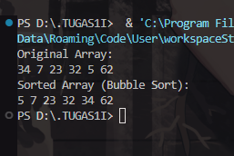
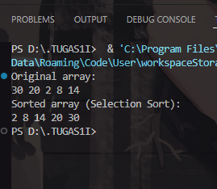
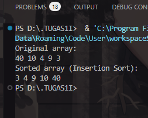
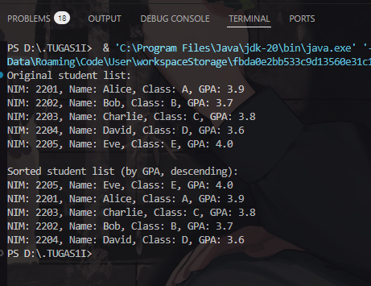
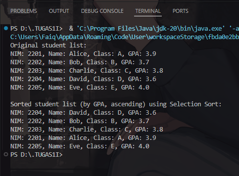
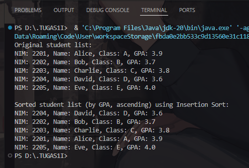
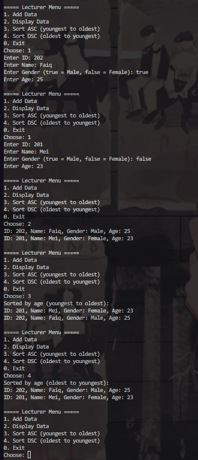

|            | Algorithm and Data Structure                 |
| ---------- | -------------------------------------------- |
| NIM        | 244107020214                                 |
| Nama       | Faiq Razzan Afifie                           |
| Kelas      | TI - 1I                                      |
| Repository | [link] (https://github.com/faiq191/JobSheet) |

# Labs #6 SORTING (BUBBLE, SELECTION, DAN INSERTION SORT)

## 6.2.1 Experiment Steps

The solution is implemented in Sorting.java, SortingMain.java and below is screenshot of the result.

## 6.2.2 Verification of Experiment Results



## 6.2.3 Verification of Experiment Results



## 6.2.4 Verification of Experiment Results



## 6.2.5 Questions!

1. This code compares two adjacent elements in the array. If the element at index j is greater than the element at j + 1, it swaps them. This helps to move larger elements toward the end of the array, like in bubble sort.

2. 
```java
public void selectionSort() {
    for (int i = 0; i < size - 1; i++) {
        int minIndex = i;
        for (int j = i + 1; j < size; j++) {
            if (data[j] < data[minIndex]) {
                minIndex = j;
            }
        }
        int temp = data[i];
        data[i] = data[minIndex];
        data[minIndex] = temp;
    }
}
```

3. This condition ensures we are within array bounds and shifts all elements greater than key to the right to make space for inserting key at its correct position.

4. This command shifts data[j] one position to the right, making space to insert the key value in its correct sorted position.


## 6.3.2 Experiment Steps

The solution is implemented in Student12.java, StudentDemo12.java, TopStudent12.java and below is screenshot of the result.

## 6.3.3 Verification of Experiment Results



## 6.3.4 Questions!

1. Bubble Sort Theory

## a. Why is the condition in the `bubbleSort()` loop `i < idx - 1`?
Because the bubble sort algorithm only needs `n - 1` iterations to sort all elements. Each iteration moves the largest element to its final position, so `idx - 1` iterations are enough.

## b. Why is the condition in the `bubbleSort()` loop `j < idx - i - 1`?
Because after each outer iteration (i), the largest element is already at the end position and does not need to be compared anymore. Therefore, the comparison length in the inner loop (`j`) decreases by 1 every iteration.

## c. If the amount of data in `listStudents` is 50:
- Loop `i` will run **49 times**.
- Therefore, the number of **stages of Bubble Sort** performed is **49 stages**.

---
2. Modified Program (Dynamic Input)

```java
import java.util.Scanner;

public class StudentDemo12 {
    public static void main(String[] args) {
        Scanner sc = new Scanner(System.in);
        TopStudents12 data = new TopStudents12();

        System.out.println("Enter student data:");

        for (int i = 0; i < 5; i++) {
            System.out.print("NIM: ");
            String nim = sc.nextLine();
            System.out.print("Name: ");
            String name = sc.nextLine();
            System.out.print("Class: ");
            String studentClass = sc.nextLine();
            System.out.print("GPA: ");
            double gpa = sc.nextDouble();
            sc.nextLine(); // consume newline

            Student12 s = new Student12(nim, name, studentClass, gpa);
            data.add(s);
        }

        System.out.println("\nOriginal student list:");
        data.print();

        data.bubbleSort();
        System.out.println("\nSorted student list (by GPA, descending):");
        data.print();

        sc.close();
    }
}
```

## 6.3.8 Verification of Experiment Results



## 6.3.9 Questions!

- This code is searching for the index of the smallest GPA value in the unsorted part of the array, starting from index i.
- minIndex holds the index of the currently known minimum GPA.
- The for loop goes through the elements from i + 1 to the end of the array (idx).
- It compares each student's GPA (listStudents[j].gpa) with the GPA of the current minimum (listStudents[minIndex].gpa).
- If it finds a smaller GPA, it updates minIndex to the index of that smaller value.
- After the loop finishes, minIndex will point to the student with the lowest GPA in that range, which will then be swapped with the student at position i.

## 6.3.12 Verification of Experiment Result



## 6.3.13 Question

```java
public void insertionSort() {
    for (int i = 1; i < idx; i++) {
        Student12 temp = listStudents[i];
        int j = i;

        // Move elements that have smaller GPA to the right
        while (j > 0 && listStudents[j - 1].gpa < temp.gpa) {
            listStudents[j] = listStudents[j - 1];
            j--;
        }

        listStudents[j] = temp;
    }
}

```

## Assignment
Code:
```java
public class Lecturer {
    String id;
    String name;
    boolean gender; // true = male, false = female
    int age;

    Lecturer(String id, String name, boolean gender, int age) {
        this.id = id;
        this.name = name;
        this.gender = gender;
        this.age = age;
    }

    void print() {
        System.out.println("ID: " + id + ", Name: " + name + ", Gender: " + (gender ? "Male" : "Female") + ", Age: " + age);
    }
}

public class LecturerData {
    Lecturer[] lecturerData = new Lecturer[10];
    int idx = 0;

    void add(Lecturer dsn) {
        if (idx < lecturerData.length) {
            lecturerData[idx++] = dsn;
        } else {
            System.out.println("Lecturer data is full.");
        }
    }

    void print() {
        for (int i = 0; i < idx; i++) {
            lecturerData[i].print();
        }
    }

    void sortingASC() {
        for (int i = 0; i < idx - 1; i++) {
            for (int j = 0; j < idx - i - 1; j++) {
                if (lecturerData[j].age > lecturerData[j + 1].age) {
                    Lecturer temp = lecturerData[j];
                    lecturerData[j] = lecturerData[j + 1];
                    lecturerData[j + 1] = temp;
                }
            }
        }
    }

    void sortingDSC() {
        for (int i = 1; i < idx; i++) {
            Lecturer temp = lecturerData[i];
            int j = i;
            while (j > 0 && lecturerData[j - 1].age < temp.age) {
                lecturerData[j] = lecturerData[j - 1];
                j--;
            }
            lecturerData[j] = temp;
        }
    }
}

import java.util.Scanner;

public class LecturerMain {
    public static void main(String[] args) {
        Scanner sc = new Scanner(System.in);
        LecturerData data = new LecturerData();
        int choice;

        do {
            System.out.println("\n===== Lecturer Menu =====");
            System.out.println("1. Add Data");
            System.out.println("2. Display Data");
            System.out.println("3. Sort ASC (youngest to oldest)");
            System.out.println("4. Sort DSC (oldest to youngest)");
            System.out.println("0. Exit");
            System.out.print("Choose: ");
            choice = sc.nextInt();
            sc.nextLine(); // Consume newline

            switch (choice) {
                case 1:
                    System.out.print("Enter ID: ");
                    String id = sc.nextLine();
                    System.out.print("Enter Name: ");
                    String name = sc.nextLine();
                    System.out.print("Enter Gender (true = Male, false = Female): ");
                    boolean gender = sc.nextBoolean();
                    System.out.print("Enter Age: ");
                    int age = sc.nextInt();
                    data.add(new Lecturer(id, name, gender, age));
                    break;

                case 2:
                    data.print();
                    break;

                case 3:
                    data.sortingASC();
                    System.out.println("Sorted by age (youngest to oldest):");
                    data.print();
                    break;

                case 4:
                    data.sortingDSC();
                    System.out.println("Sorted by age (oldest to youngest):");
                    data.print();
                    break;

                case 0:
                    System.out.println("Exiting...");
                    break;

                default:
                    System.out.println("Invalid choice.");
            }

        } while (choice != 0);
    }
}

```
Output
