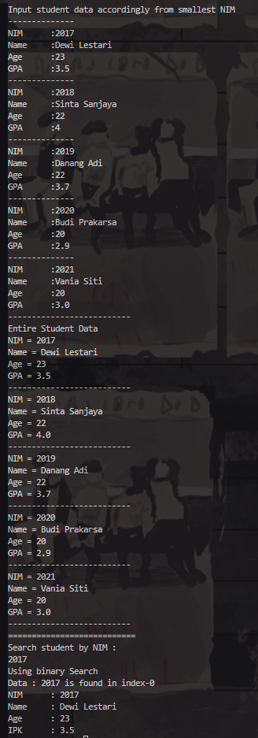
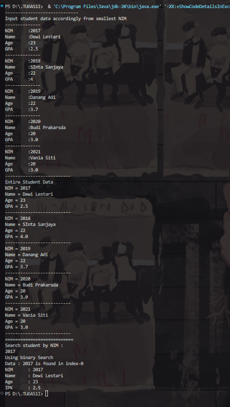
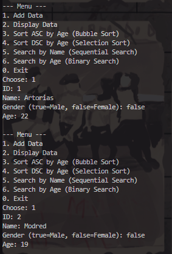
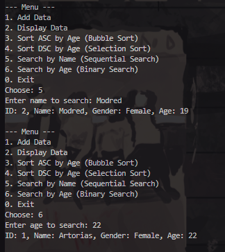

|            | Algorithm and Data Structure                 |
| ---------- | -------------------------------------------- |
| NIM        | 244107020214                                 |
| Nama       | Faiq Razzan Afifie                           |
| Kelas      | TI - 1I                                      |
| Repository | [link] (https://github.com/faiq191/JobSheet) |

# Labs #7 SEARCHING

## 7.2 Sequential Search Method



## Question

1. showPosition() displays the index position in the array where the student with the given NIM was found mean while showData() displays the complete student information (NIM, name, age, GPA) if the student is found.
2. The break statement is used to exit the loop as soon as the desired NIM is found
3. No error, and the result will still be correct simply because sequential search checks each element one by one regardless of order.
4. -1 is used to indicate that the data was not found because If it were 0, and the data was not in the list.

## 7.3 Binary Search Method



## Question

1. Show the program code that runs the divide process
In binary search, the divide process happens when the array is split by calculating the middle index:

```java
int mid = (left + right) / 2;
```
Full code snippet (divide part):
```java
int binarySearch(int[] data, int left, int right, int key) {
    if (left <= right) {
        int mid = (left + right) / 2; // divide here
        // ...
    }
    return -1;
}
```

2. Show the program code that runs the conquer process
The conquer process is when the algorithm decides whether to continue searching in the left or right half:
```java
if (data[mid] == key) {
    return mid;
} else if (data[mid] > key) {
    return binarySearch(data, left, mid - 1, key); // search left
} else {
    return binarySearch(data, mid + 1, right, key); // search right
}
```
3. If the inserted NIM data is not sorted, will the result be correct?
No.
Binary search only works correctly if the data is sorted in ascending order.

If the data is sorted in descending order, or not sorted at all, binary search will likely fail or return incorrect results.

Example:
Data: `20215, 20214, 20212, 20211, 20210`
Search: `20210`
Result: `Not found (regular binary search fails).`

Solution: `Binary search for descending order`
You can modify the comparison logic to handle descending order like this:
```java
if (data[mid] == key) {
    return mid;
} else if (data[mid] < key) {
    return binarySearch(data, left, mid - 1, key); // reverse direction
} else {
    return binarySearch(data, mid + 1, right, key);
}
```
A better approach is to check the sort order before searching:
```java
boolean isAscending = data[0] < data[data.length - 1];
Then perform binary search accordingly.
```
4. Modify the program so that the number of students is based on user input
Add a Scanner and allow the user to input the number of student NIMs:
```java
import java.util.Scanner;

public class BinarySearchExample {

    public static void main(String[] args) {
        Scanner sc = new Scanner(System.in);

        System.out.print("Enter number of students: ");
        int n = sc.nextInt();
        int[] data = new int[n];

        System.out.println("Enter student NIMs:");
        for (int i = 0; i < n; i++) {
            data[i] = sc.nextInt();
        }

        System.out.print("Enter NIM to search for: ");
        int key = sc.nextInt();

        boolean isAscending = data[0] < data[n - 1];
        int result = binarySearch(data, 0, n - 1, key, isAscending);

        if (result != -1) {
            System.out.println("NIM found at index: " + result);
        } else {
            System.out.println("NIM not found.");
        }
    }

    public static int binarySearch(int[] data, int left, int right, int key, boolean ascending) {
        if (left <= right) {
            int mid = (left + right) / 2;

            if (data[mid] == key) {
                return mid;
            }

            if (ascending) {
                if (data[mid] > key) {
                    return binarySearch(data, left, mid - 1, key, true);
                } else {
                    return binarySearch(data, mid + 1, right, key, true);
                }
            } else {
                if (data[mid] < key) {
                    return binarySearch(data, left, mid - 1, key, false);
                } else {
                    return binarySearch(data, mid + 1, right, key, false);
                }
            }
        }
        return -1;
    }
}
```

## 7.5 Assignments



