|  | Algorithm and Data Structure |
|--|--|
| NIM |  244107020214|
| Nama |  Faiq Razzan Afifie |
| Kelas | TI - 1I |
| Repository | [link] (https://github.com/jti-polinema/-01-contoh-laporan-react) |

# Labs #1 Programming Fundamentals Review

## 2.1.1. Selection Solution

The solution is implemented in Selection.java, and below is screenshot of the result.

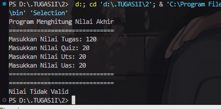 
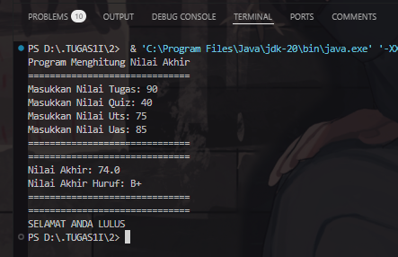

**Brief explanaton:** 
1. Input: The user enters scores for each component.  
2. Validation: If any score is outside the range of 0-100, the program displays "Invalid Score" and terminates.  
3. Calculation: The final grade is computed using a weighted formula.  
4. Conversion: The final grade is converted into a letter grade and a qualification description.  
5. Output:  
   - Displays the final grade, letter grade, and qualification.  
   - Determines whether the user passes (score > 50) or fails (score ≤ 50).  

The program uses if-else statements for grading classification and closes the Scanner after execution.

## 2.2.1. Looping Solution

The solution is implemented in nimLooping.java, and below is screenshot of the result.

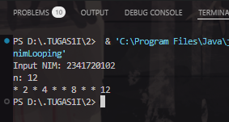
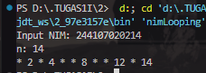

**Brief explanaton:**
1. Input: The program prompts the user to input their NIM (student ID).  
2. Extracting n: It takes the last two digits of the NIM and converts them into an integer (n).  
   - If n is less than 10, it is increased by 10.  
3. Output n: The value of n is printed.  
4. Looping:  
   - Iterates from 1 to n.  
   - Skips numbers 6 and 10 using `continue`.  
   - Prints "*" for odd numbers and the number itself for even numbers.  
5. Scanner is closed at the end to prevent resource leaks.

## 2.3.1. Array Solution

The solution is implemented in arrayGrade.java, and below is screenshot of the result.

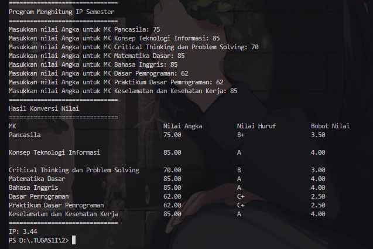

**Brief explanaton:**
1. Input: The user enters numerical scores for 8 subjects.  
2. Conversion: Each score is converted into a letter grade and a weighted grade (GPA scale).  
3. IP Calculation: The total GPA is summed and divided by the number of subjects to get the semester GPA (IP).  
4. Output: Displays a table with subject names, numerical scores, letter grades, and GPA weights.  
5. IP Display: The final semester GPA (IP) is printed.  

The program uses a `data` class to store subject names, scores, and grades. Functions are used for input, conversion, calculation, and display.

## 2.4.1. Function Solution

The solution is implemented in Function.java, and below is screenshot of the result.

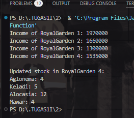

**Brief explanaton:**
1. The program has arrays for plant prices, stock levels, and stock reductions.
2. It calculates the income for each RoyalGarden by multiplying stock with prices.
3. It updates and prints the remaining stock for RoyalGarden 4 after reducing the stock values.
4. The `main()` method runs the income calculation and stock update functions in sequence.

## 3. Assignment 1 Solution

The solution is implemented in Assignment1.java, and below is screenshot of the result.

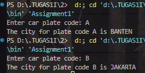
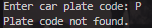

**Brief explanaton:**
1. The program stores a list of car plate codes (`CODE[]`) and corresponding city names (`CITY[][]`).
2. It prompts the user to input a car plate code.
3. It searches for the input plate code in the `CODE[]` array.
4. If the code is found, it prints the corresponding city name by retrieving characters from the `CITY[][]` array.
5. If the code is not found, it informs the user that the plate code is not found.
6. The program processes the input in uppercase and handles the search case-sensitive.

## 3. Assignment 2 Solution

The solution is implemented in Assignment2.java, and below is screenshot of the result.

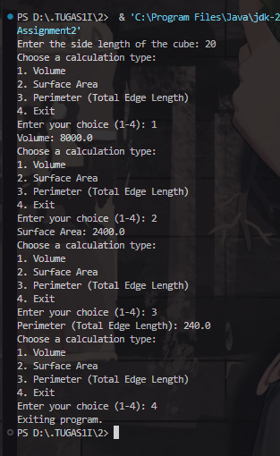

**Brief explanaton:**
1. The program prompts the user to enter the side length of a cube.
2. It then presents a menu with 4 options: calculate volume, surface area, perimeter, or exit.
3. Based on the user's choice:
   - **Volume**: Calculates and displays the cube's volume (side^3).
   - **Surface Area**: Calculates and displays the cube's surface area (6 * side^2).
   - **Perimeter**: Calculates and displays the total edge length (12 * side).
4. The program keeps asking for input until the user chooses to exit (option 4).
5. If the user enters an invalid option, the program will prompt for a valid choice.

## 3. Assignment 3 Solution

The solution is implemented in Assignment3.java, and below is screenshot of the result.

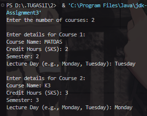
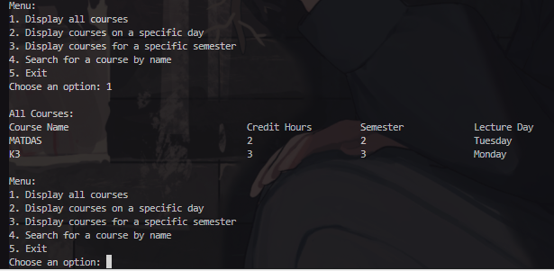
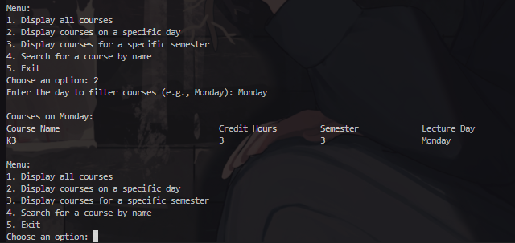
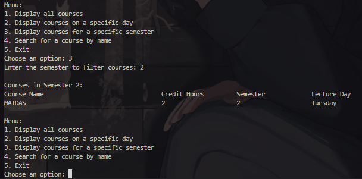
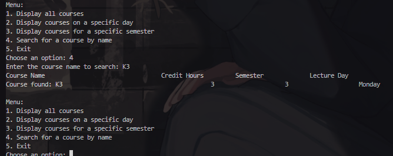
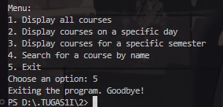

**Brief explanaton:**
1. Input Phase:
    - The user enters the number of courses.
    - For each course, details like the course name, credit hours, semester, and lecture day are input.
2. Menu: After entering the course details, the user can choose from the following options:
    1. Display all courses: Shows all course details.
    2. Display courses on a specific day: Filters courses by lecture day.
    3. Display courses for a specific semester: Filters courses by semester.
    4. Search for a course by name: Allows searching for a course by name.
    5. Exit: Exits the program.
3. Methods:
    - displayAllCourses: Displays all courses.
    - displayCoursesByDay: Filters courses by a specific day.
    - displayCoursesBySemester: Filters courses by semester.
    - searchCourseByName: Searches for and displays a course by its name.
The program uses arrays to store data and the Scanner class for user input.
